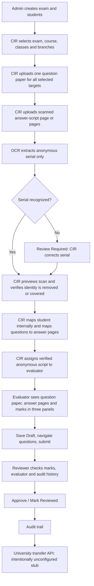

# Digital Examination Evaluation: Project Guide

This guide describes the current local workflow, setup, and remaining engineering work. It complements the [README](README.md) and [API reference](backend/docs/API.md).

## Overall Workflow



### Roles

- **Admin:** oversees students, exams, access to authorized identity mappings, and audit data. The current application has seeded role accounts and a read-only evaluator list for assignment; it does not yet have a complete user/permission administration UI.
- **CIR:** uploads question papers and answer scripts, chooses applicable branches and classes, reviews/corrects OCR serials, inspects scans, attests that student identifiers are removed or covered, links questions to paper pages and answer-page ranges, and assigns scripts.
- **Evaluator:** sees only assigned, CIR/Admin-verified scripts. Evaluator API responses omit student identity, mapping IDs, assignment IDs, OCR text, and storage paths. The workspace displays one current question, its answer key and paper page, mapped answer page(s), marks, optional comment, question navigation, and draft/submit controls.
- **Reviewer:** inspects submitted evaluation, evaluator, marks, total, and audit history, then marks the evaluation reviewed. Reviewed work leaves the active queue.
- **Examiner:** can use the existing student/exam workflows and selected script operations; the CIR Desk itself is restricted to Admin/CIR.

## Current Local Capabilities

- React/Vite frontend and Express/Prisma backend with SQLite, JWT authentication, bcrypt password hashing, and role authorization.
- Student CRUD and AVV Chennai roll-number validation/generation:
  - CSE/AIE/CYS use `CH.SC`.
  - CCE/ECE/RAI/AID/MEC use `CH.EN`.
  - The joining year is dynamic.
- Exam and question CRUD, answer keys, maximum marks, and question-paper page references.
- Question-paper uploads with multiple branch/class targets stored as related rows, so one upload can serve several targets.
- Answer-script upload for a single script, including multiple image files as that script's pages or a single PDF. OCR reads a serial only; it does not grade answers.
- Failed OCR is stored with `serialNumber: null` and `ocrStatus: FAILED`. Assignment is blocked until CIR corrects the serial and verifies anonymity.
- Uploads are limited by file size/count and validated by extension, declared MIME type, and file signature for PDF, PNG, and JPG/JPEG.
- Question-to-paper-page and script-question-to-answer-page mappings. A question may map to a range of answer pages.
- Server-side mark bounds/completeness validation and server-calculated totals.
- Draft, submit, reviewer approval, and lifecycle audit events.
- Local UI flow, API authorization, and both OCR success/failure paths were manually exercised in a browser during development. `backend npm test` and `frontend npm run build` pass.

## Run Locally on Windows

Prerequisites: Node.js/npm installed. Use two PowerShell terminals from the repository root. If an `.env` file already exists, keep it rather than copying over it.

**Terminal 1: backend**

```powershell
cd backend
if (!(Test-Path .env)) { Copy-Item .env.example .env }
npm install
npm run db:setup
npm run dev
```

`db:setup` pushes the Prisma schema to the local SQLite database and seeds demo accounts/data. The API is at `http://localhost:5000/api`; health check: `http://localhost:5000/api/health`.

**Terminal 2: frontend**

```powershell
cd frontend
if (!(Test-Path .env)) { Copy-Item .env.example .env }
npm install
npm run dev
```

Open `http://localhost:5173`. Keep the backend terminal running too. For a real database-backed demonstration, do not set `VITE_USE_MOCK_API=true`.

### Demo Accounts

| Role | Email | Password |
|---|---|---|
| Admin | `admin@amrita.edu` | `admin123` |
| CIR | `cir@amrita.edu` | `cir123` |
| Examiner | `examiner@amrita.edu` | `examiner123` |
| Evaluator | `faculty@amrita.edu` | `evaluator123` |
| Reviewer | `reviewer@amrita.edu` | `reviewer123` |

### Checks

```powershell
cd backend
npm test
cd ../frontend
npm run build
```

## Improvements Still Needed

1. **Batch scripts:** the current multi-file control groups files as pages of one script. Add a separate batch workflow for uploading several independent scripts with per-script student mapping, OCR status, and assignment.
2. **Guaranteed scan anonymization:** the server gates evaluator access on CIR/Admin attestation, but it does not automatically detect, mask, or redact names/roll numbers in image pixels. Production must add a trusted redaction/review process and audit evidence; do not treat the checkbox as automated redaction.
3. **Normalized academic data:** courses and class/section values are currently strings; introduce first-class course, class, and branch relationships with validation and indexes if the institution requires authoritative registries.
4. **Administration:** add user lifecycle/permission-management screens and tests. Current role accounts are seeded; assignment uses a read-only evaluator directory.
5. **PDF coverage:** PDF upload and page selection are supported, but add browser tests for multi-page PDF rendering and serial OCR. The demonstrated OCR tests used raster images.
6. **Automated end-to-end tests:** manual browser coverage was performed, but a repeatable Playwright suite for CIR, evaluator, reviewer, privacy, and persistence workflows is still needed.
7. **University transfer:** `/portal/transfer-marks/:evaluationId` intentionally returns `501` until the official university API and credentials are supplied. Do not claim that marks are transferred.

## Important Security Boundary

Evaluator access to a script, its pages, applicable question paper, and evaluation requires assignment **and** a persisted CIR/Admin anonymity review. Student identity mapping is a separate Admin/CIR-only API. This protects the application’s metadata and gates the scan, but does not prove the image pixels were redacted; CIR must inspect the actual scan, and production should strengthen this with a verifiable redaction process.
